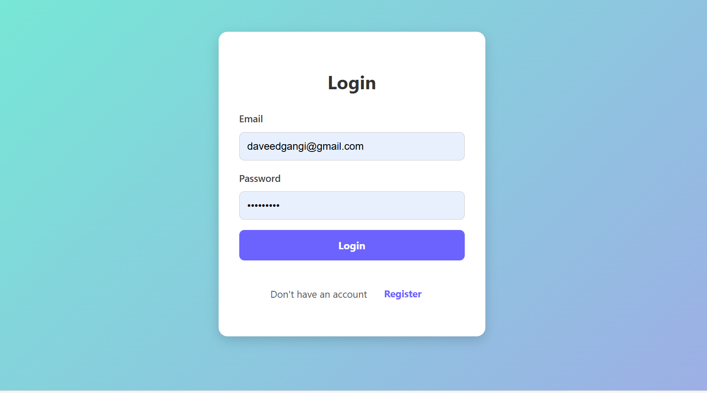
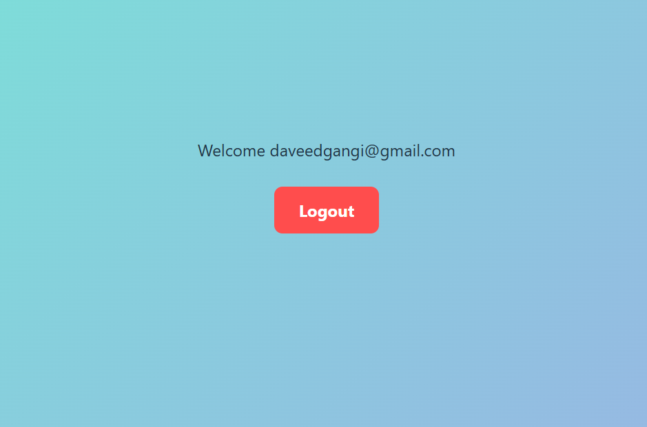
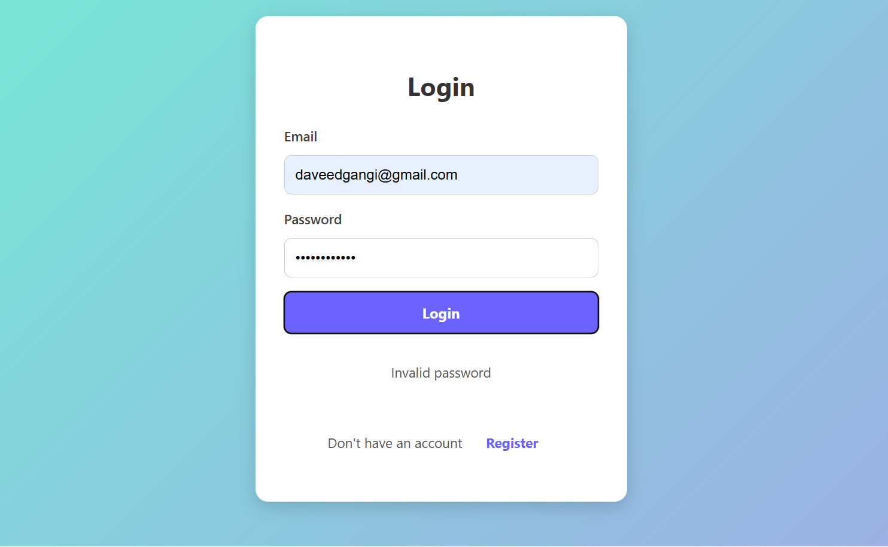
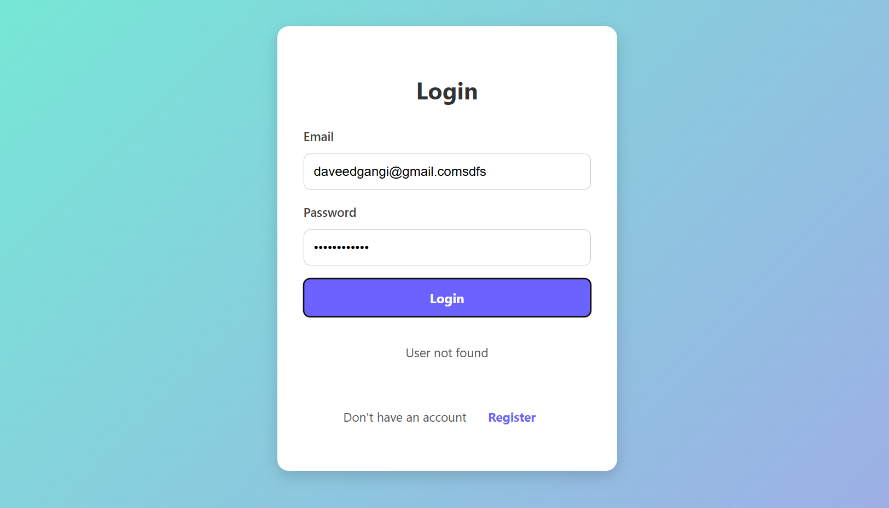

# Authentication Cookies Sessions Frontend 🍪🔑

This project is a React-based frontend application designed for user authentication using cookies and sessions. It provides a user interface for signing up, logging in, and accessing a protected dashboard. The application interacts with a backend server to handle user authentication and session management. It uses `react-router-dom` for client-side routing and `axios` for making API requests.

## 🚀 Key Features

- **User Authentication:** Allows users to create new accounts and log in to existing ones.
- **Session Management:** Uses cookies and sessions to maintain user authentication status.
- **Protected Routes:** Restricts access to certain routes based on authentication status.
- **Dashboard:** Displays user-specific information after successful login.
- **API Integration:** Communicates with a backend API for authentication and data retrieval.
- **Client-Side Routing:** Uses `react-router-dom` for seamless navigation between different views.
- **Error Handling:** Provides informative error messages for authentication failures.
- **Loading States:** Displays loading indicators during authentication checks.

## 🛠️ Tech Stack

- **Frontend:**
    - React
    - React Router DOM
    - Axios
- **Build Tool:**
    - Vite
- **CSS:**
    - Custom CSS
- **Other:**
    - JavaScript (ES6+)
    - JSX

## 📦 Getting Started

These instructions will get you a copy of the project up and running on your local machine for development and testing purposes.

### Prerequisites

- Node.js (version 14 or higher)
- npm or yarn

### Installation

1.  Clone the repository:

    ```bash
    git clone <repository_url>
    ```

2.  Navigate to the project directory:

    ```bash
    cd <project_directory>
    ```

3.  Install the dependencies:

    ```bash
    npm install
    # or
    yarn install
    ```

### Running Locally

1.  Start the development server:

    ```bash
    npm run dev
    # or
    yarn dev
    ```

2.  Open your browser and navigate to `http://localhost:5173` (or the port specified by Vite).

## 💻 Usage

1.  **Signup:** Navigate to the `/login-signup` route and fill in the signup form with your email and password.
2.  **Login:** If you already have an account, switch to the login form and enter your credentials.
3.  **Dashboard:** After successful login, you will be redirected to the `/dashboard` route, where you can view your user information.
4.  **Logout:** Click the logout button on the dashboard to end your session.

## 📂 Project Structure

```
├── public/
│   └── _redirects
├── src/
│   ├── components/
│   │   ├── Dashboard/
│   │   │   ├── dashboard.jsx
│   │   │   └── dashboard.css
│   │   ├── ProtectedRoute/
│   │   │   └── ProtectedRoute.jsx
│   │   ├── SignUpAndLogin/
│   │   │   ├── signup-login.jsx
│   │   │   └── index.css
│   ├── Api.jsx
│   ├── App.jsx
│   ├── main.jsx
│   ├── index.css
├── vite.config.js
├── package.json
├── README.md
```

## 📸 Screenshots












## 🤝 Contributing

Contributions are welcome! Please follow these steps:

1.  Fork the repository.
2.  Create a new branch for your feature or bug fix.
3.  Make your changes and commit them with descriptive messages.
4.  Push your changes to your fork.
5.  Submit a pull request.

## 📬 Contact

If you have any questions or suggestions, feel free to contact me at [daveeddaveedd@gmail.com](mailto:daveeddaveedd@gmail.com).

## 💖 Thanks

Thank you for checking out this project! I hope it's helpful.
